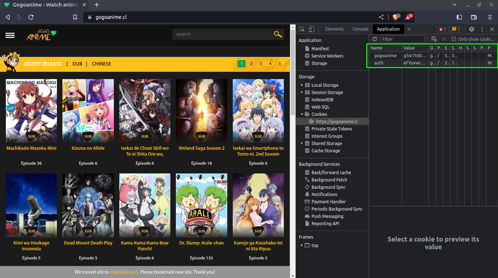

# Gogoanime Downloader

## Features
* Single episode download
* Multiple episode download
* Resumeable

## Setup
Install python3 any version.[website](https://www.python.org/)
### Clone repository
```
git clone git@github.com:HSAkash/Gogoanime-Downloader.git
```
### Create environment
```
python -m venv env
```
activate environment `Linux`
```
source env/bin/activate
```
activate environment `Windows`
```
env/Scripts/activate.bat
```
### Install dependencies
```
pip install -r requirements.txt
```

## Directories
<pre>
│  
├─gogoanime.py
│
├─.env
|
</pre>

## Setup .env file
gogoanime, auth get from browser cookie.
<p>

<p>
After geting the environment variable then you can use the following steps to set the environment.
Go to the .env file and configure the environment
```
gogoanime=gogoanime
auth=HSAkash
```

# Run the command
```
python gogoanime.py
```
details:<br>
Anime url: anime url from gogoanime site.<br>
Video Quality: 360, 480, 720, 1080<br>
Download Type:<br>
    1. Single Episode/ Video<br>
    2. Multiple Episodes/ Videos <br>

Episode from : Starting from<br>
Episode to : Ending Episode<br>